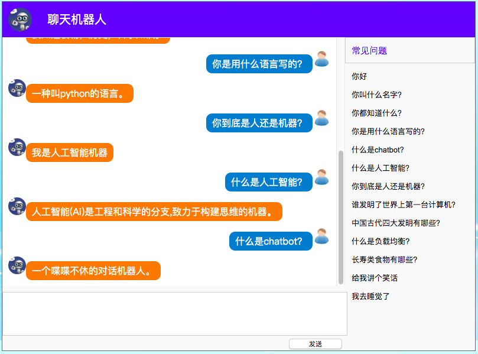
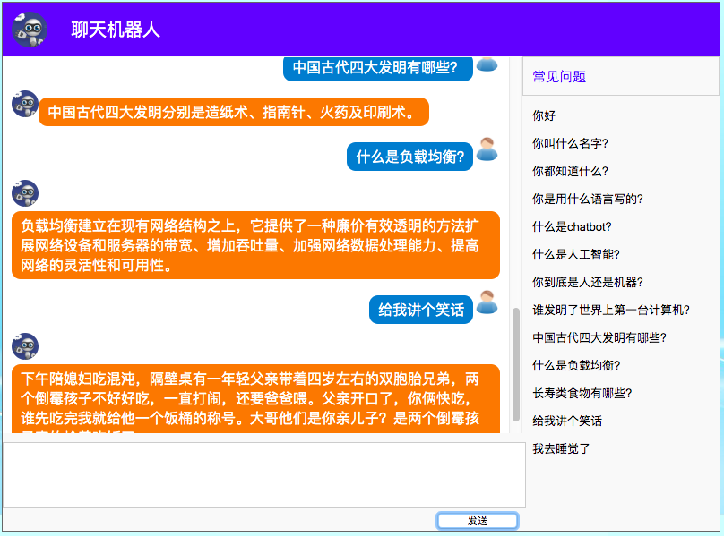
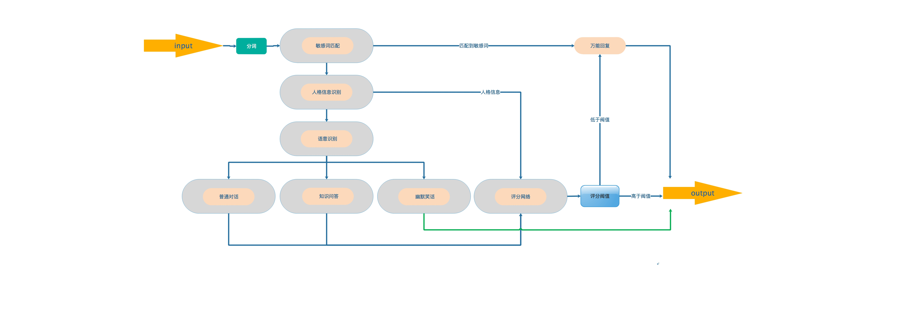
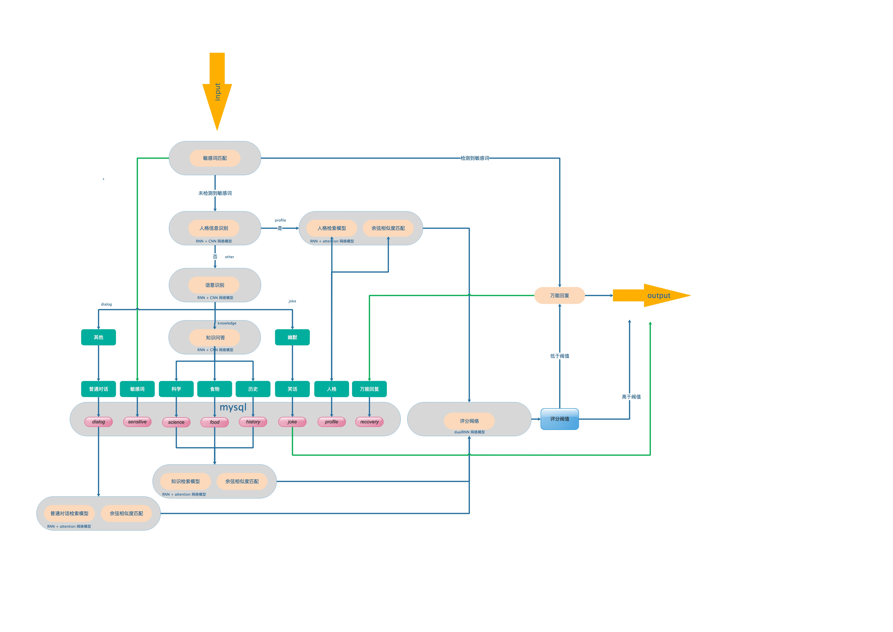
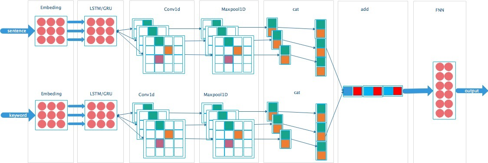
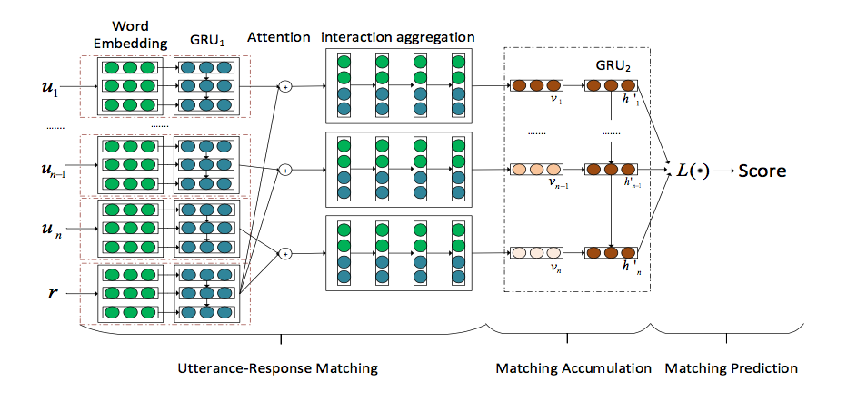
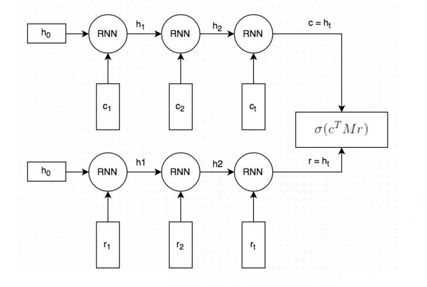

## 简述

简单构建一款聊天机器人！






## 功能
1. 敏感词匹配
2. 人格信息识别
3. 人格信息检索
3. 句意识别
4. 普通对话检索
5. 问答知识识别
6. 问答知识检索
7. 幽默笑话检索
8. 万能回答
9. 评分模型

## 设计流程



对于chatbot的设计流程，个人参考了一些网上的设计流程，我个人比较喜欢[这个流程](https://zhuanlan.zhihu.com/p/34927757)。
当然该流程并非完美，个人在此基础上进行修改，添加了句意识别模块和知识识别模块，删除了文本生成模型。
加入这两个模块一方面主要是增加chatbot的丰富性，让chatbot可以进行普通聊天，也可以进行知识问答。
删除文本生成模型，主要是由于个人没有找到适用训练生成模型的语料，同时文本生成模型在目前技术下，个人认为并不成熟。

### 详细设计流程图


在 chatbot 中，个人使用 mysql 数据库作为语料的存取。使用数据库可对语料进行规范化管理，同时方便进行二次检索。 

### 敏感词匹配

chatbot中的敏感词来自网络，可在 chinese_corpus/source/sensitive_word/sensitive_word.txt 中查看。

### 人格信息模块

人格信息模块主要是针对在对话聊天中，可能会对chatbot的一些个人信息的提问。
比如："你叫什么名字？"、"你来自哪里？" 等。该情况下，我们通常的回复的是："我叫 XX"、" 我来自 XX(地名)".
对此在人格信息模块中，需要先识别提问的句子是否是关于人格信息的提问，如果是则需要根据该提问进行检索，如果不是则进入到下一个句意识别模块。

#### 人格信息识别模块

人格信息识别模块，采用了的网络模型为 RNN + CNN 模型。 详细信息可在网络模型进行查看

#### 人格信息检索模块

人格信息检索模块，采用的网络模型为 RNN + Attention + RNN 模型。 详细信息可在网络模型进行查看

#### 余弦相似度

余弦相似度用向量空间中两个向量夹角的余弦值作为衡量两个个体间差异的大小。余弦值越接近1，就表明夹角越接近0度，也就是两个向量越相似，这就叫"余弦相似性"。

余弦相似度匹配。即通过提问的句子和语料中的问句使用余弦相似度的方法进行匹配。可参考[这里](https://www.cnblogs.com/dsgcBlogs/p/8619566.html)

### 句意识别模块

句意识别模块。即分析用户提问的句子是关于那一块的内容。 是普通对话、知识问答、还是幽默笑话。 

```
通常情况下，如果用户发送的句子为："晚安！"、"我好无聊"、"我郁闷怎么办" 。则定义为普通对话，

如果用户发送的句子为："什么是人工智能？"、"中国古代四大发明有哪些？"。 则定义为知识问答

如果用户发送的句子为："给我讲个笑话"、"换一个笑话"。 则定义为幽默笑话
```

句意识别。采用了的网络模型为 RNN + CNN 模型。 详细信息可在网络模型进行查看

### 普通对话

普通对话。即在句意识别块中标记为普通对话情况下。

#### 检索模块

对话检索模块，采用的网络模型为 RNN + Attention + RNN 模型。 详细信息可在网络模型进行查看

#### 余弦相似度

余弦相似度与上面一致。

### 知识问答

知识问答。即在句意识别块中标记为知识问答情况下。

#### 知识类型识别

识别提问的知识是关于那一块的内容。即历史、食物、科学？

```
通常情况下，如果用户发送的句子为："土豆有什么营养？"。则定义为食物知识

如果用户发送的句子为："中国古代四大发明有哪些？"。 则定义为历史知识

如果用户发送的句子为："什么是惯性定律？"。则定义为科学知识

```

#### 知识检索

知识检索模块，采用的网络模型为 RNN + Attention + RNN 模型。 详细信息可在网络模型进行查看

#### 余弦相似度

余弦相似度与上面一致。

### 幽默笑话

在句意识别标记为幽默笑话的情况下，将随机从语料库中随机检索一个笑话进行回复。

### 评分网络

在 chatbot 中，使用余弦相似度、检索模型 两种方式确定回复。然而最终需要从该两种的检索中选择其中一种进行回复。这就用到了评分网络。

评分网络即在余弦相似度和检索模型中对各自的检索回复做一个评分，评分越高越好。

评分网络采用dualRNN网络结构。可在网络模型中查看详细信息。

### 评分阀值

评分阀值。一个float 类型，在(0~1)之间，通常高于>=0.9。对与评分网络给出的评分，如果评分大于阀值，则采用检索回复。如果低于阀值则采用万能回复

### 万能回复

即在发现敏感词或低于评分阀值的情况下，采用万能回复。如： "呵呵", "嗯嗯" 等。

可在 chinese_corpus/source/any_reply/any_reply.json 查看chatbot定义的万能回复。

## 网络模型

在 chatbot 中主要采用三种网络模型结构。

一种是分类网络模型，采用 RNN + CNN 模型。

一种是文本检索模型，采用 RNN + Attention + RNN 模型。

一种是评分模型，采用DualRNN 网络模型

### 分类网络模型
在chatbot中，对于人格信息的识别、句意识别、知识类型识别采用的分类网络模型。该网络模型结构：



```
输入：(1)句子向量. (2) 关键词向量
输出：类别概率

网络模型由 循环神经网络(LSTM/GRU) + 卷积神经网络(CNN) + 全连接神经网络(FNN) 组成。

循环神经网络，可在项目中指定使用。个人认为LSTM效果会好一些。
可在此查看循环神经网络的资料：https://blog.csdn.net/sinat_32590125/article/details/80571701

卷积神经网络1维卷积模式，指定 kernel_size = [2, 3, 4] 分别对向量进行特征提取, 然后 BN 层归一化， 使用 relu 激活函数，再进过Maxpool1d池化层，最后提取的特征维(batch, 1, 2)。将提取的特征进行cat拼接成(batch, 1, 6)
关于卷积神经网络提取句子特征，可在此查看详细资料：https://www.cnblogs.com/bymo/p/9675654.html

由卷积词提取的关键词和句子特征向量，项目中采用加权的方式，将关键词和句子特征进行相加，然后输入到全连接神经网络。
```

参考资料：
https://www.cnblogs.com/bymo/p/9675654.html
https://blog.csdn.net/sinat_32590125/article/details/80571701

### 文本检索网络

在chatbot中，人格信息检索、对话检索、知识问答检索采用的检索模型。

检索神经网络模型结构图：



检索神经网络模型参考[论文](http://xueshu.baidu.com/usercenter/paper/show?paperid=e754d856439a3d19e9db1606c456aba6&site=xueshu_se)
论文中提到的SAN网络模型，即基于注意力的文本检索模型。

```
输入：(1) 提问的句子 (2) 回答的句子 (3) 提问句子的关键词 (4) 回答句子的关键词
输出： 正确：1，错误：0

网络模型组成： 循环神经网络-[1](LSTM/GRU) + attention + 循环神经网络-[2](LSTM/GRU) + 全连接神经网络(FNN) 组成

循环神经网络，可在项目中指定使用。个人认为GRU效果会好一些。

attention 为论文中提到的注意力机制。可在论文中查看详细信息。
```
参考论文：
[A Sequential Matching Framework for Multi-turn Response Selection in Retrieval-based Chatbots](http://xueshu.baidu.com/usercenter/paper/show?paperid=e754d856439a3d19e9db1606c456aba6&site=xueshu_se)

### 评分网络

评分网络为 dualRNN（双边循环神经网络）。早期用于检索型聊天机器人的常用模型。模型结构如下图：



参考资料
https://blog.csdn.net/Irving_zhang/article/details/78788929

## 目录结构

```
├── chat.py                             # 导入数据库、创建词库、启动web服务的主要文件
├── chinese_corpus                      # 中文语料目录
│   ├── source                          # 个人收集的语料
│   │   ├── any_reply                   # 万能回复语料
│   │   │   └── any_reply.json
│   │   └── sensitive_word              # 敏感词语料
│   │       └── sensitive_word.txt
│   └── target                          # 训练语料。即划分好的train、valid、test 数据集。保存在csv文件中
├── config.json                         # chatbot 配置文件
├── env                                 # 环境配置。可在此查看部署需要的python库               
├── image                               # 图片目录
├── model                               # 训练保存的模型
├── module                              # 模块
│   ├── any_reply                       # 万能回复模块
│   │   ├── any_reply.py                
│   ├── chatbot                         # 构建 chatbot 模块
│   │   ├── chatbot.py
│   ├── core                            # 核心模块，包括网络模型、数据库读写、数据集划分等
│   │   ├── data_utils.py
│   │   ├── __init__.py
│   │   ├── loading_dataset.py
│   │   ├── mysql_exec.py
│   │   ├── mysql_fuzzy_query.py
│   │   ├── mysql_table.py
│   │   ├── network_model.py
│   │   ├── third_library
│   │   ├── thread.py
│   │   ├── utterance.py
│   │   └── word_sequences.py
│   ├── dialog                         # 普通对话模块
│   │   ├── dialog.py
│   ├── joke                           # 幽默笑话模块
│   │   ├── joke.py
│   ├── knowledge                      # 知识模块
│   │   ├── knowledge.py
│   ├── network                        # 训练网络模块。可在此训练网络模型
│   │   ├── build.py
│   │   ├── config.json                # 训练网络模型的配置文件，包括 hidden_size、dropout、lstm／gru 等
│   │   ├── dialog.py
│   │   ├── knowledge.py
│   │   ├── main.py                    # 训练网络模型的主要文件，在此执行训练模型
│   │   ├── profile.py
│   │   ├── score.py
│   │   └── semantics.py
│   ├── profile                        # 人格信息模块
│   │   ├── profile.py
│   ├── score                          # 评分模块
│   │   └── score.py
│   ├── semantics                      # 句意识别模块
│   │   └── semantics.py
│   ├── sensitive_word                 # 敏感词模块
│   │   └── sensitive_word.py
│   └── web                            # web 聊天页面
│       ├── favicon.ico
│       ├── static
│       ├── templates
│       │   └── index.html
│       └── web.py
├── mysql_backup                       # mysql 备份数据库
│   └── chatbot.sql
├── README.md
├── test.py
└── word_sequence                      # 词库文件
    └── word_sequence.pickle

```

## 快速使用

### 安装相关的库

需要运行的库主要包括：numpy,pandas,pytorch,tqdm,json,pymysql,jieba,flask
可使用pip、或 conda 进行快速安装。

具体可见 env/env.yaml 或 env/requirements.txt

### 创建数据库

chatbot 检索数据需要使用mysql数据库。可在[mysql官网](https://dev.mysql.com/downloads/mysql/)下载安装。

个人使用的数据库版本： 5.7.22 MySQL Community Server (GPL)

创建数据库，example：
```
# CREATE DATABASE `chatbot`
```

### 导入数据

chatbot 中可自定义数据，训练自己的模型。也可导入笔者自己创建的数据集，作为语料。（个人语料可在chinese_corpus/source查看）

在当前的chatbot中，我个人使用的数据集比较小，但在一定条件下也会有比较好的效果！

步骤：

(1) 配置 config.json 文件。

主要配置config.json文件中的 mysql 配置。以及 data 配置。可在 config.json 中查看实例。
```
 "mysql": {
      "host": "连接 mysql 的主机地址",
      "user": "mysql 用户名",
      "password": "mysql 用户对应的密码",
      "db": "数据库"
    },
 "data": {
      "file": "数据文件",
      "type": "数据类型分为qa,dialog,joke,profile,sensitive_word,any_reply; qa 即知识问答类型,dialog对话数据类型,joke即笑话/幽默数据类型,profile 即人格信息数据, sensitive_word 即敏感词, any_reply 即万能回复",
      "file_type": "txt 文件格式。普通文件格式",
      "label": "数据类型的标签",
      "category": "数据类型的类别",
      "start_tag": "数据中如果有标记开始的字段，则写入，如果无则填None",
      "end_tag": "数据中如果有标记结束的字段，则写入，如果无则填None",
      "ask_tag": "标记问的字符",
      "answer_tag": "标记答的字符",
      "skip_line": "指定需要忽略的数据行",
      "desc": "描述。对数据的描述",
      "split_tag": "敏感词中词与词之间的标记，语料中默认使用 '，' 划分",
      "field": "用于在any_reply回复中标记数据。"
 },
```
(2) 执行导入
```
# python chat.py config.json -m write_mysql  
```

个人备份了数据库文件在mysql_backup中，为个人使用的数据集。可使用命令快速恢复数据库：
```
mysql -uroot -p -h127.0.0.1 --default-character-set=utf8 chatbot < chatbot.sql
```

### 创建词库
NLP 中，创建词库为比不可少的步骤。程序通过读取mysql中的数据，使用jieba进行分词。创建词库。

执行：
```
python chatbot.py config.json -m create_word_sequence --save_path ../save_word_sequence/ --filename word_sequence.pickle

# --save_path  指定保存路径
# --filename   指定保存的文件名
```
创建词库。指定保存路径为： ../save_word_sequence/word_sequence.pickle

### 训练模型

chatbot 中使用的检索模型、分类模型、评分模型可在 module/network/ 中进行训练。

example:

训练句意识别模型

步骤：
(1) 配置 module/network/config.json 配置文件。

在此指定网络模型详细的配置信息。 可在 module/network/config.json 中查看实例。
```
"context": {
    "mysql": {
      "host": "连接 mysql 的主机地址",
      "user": "mysql 用户名",
      "password": "mysql 用户对应的密码",
      "db": "数据库"
    },
    "word_sequence_file": "词库文件保存路径",
    "profile_distinguish_model": "人格信息识别网络",
    "profile_retrieval_model": "人格信息检索网络",
    "semantics_distinguish_model": "句意识别网络",
    "knowledge_category_model": "知识类别网络",
    "knowledge_retrieval_model": "知识检索网络",
    "dialog_retrieval_model": "对话检索网络",
    "score_model": "评分网络",
    "split_dataset": {
      "valid_size": "验证数据集与训练数据集的比例，0～1 之间",
      "test_size": "测试数据集与总数据集之间的比例, 0~1 之间",
      "thread_num": "划分数据集的线程数量，仅用于检索网络",
      "error_ratio": "检索网络中正确与错误数据集的比例，如 5 则正确数据集与错误数据集之间的比例为1：5"
    },
    "network": {
      "embed_size": "网络嵌入层大小",
      "rnn_hidden_size": "RNN神经网络隐藏层大小",
      "seq_len": "保留句子的最大长度",
      "output": "输出层的大小",
      "rnn_model": "指定使用的循环神经网络的类型，即 lstm 或 gru",
      "drop_out": "随机关闭训练节点的比例",
      "learning_rate": "学习率的大小",
      "epochs": "训练轮次",
      "device": "指定训练的设备, cpu 或 cuda",
      "weight_decay": "衰减系数，防止过拟合的手段",
      "batch_size": "训练样本大小",
      "threshold": "评分阀值，仅用于评分网络中。即当超过该阀值时",
      "save_final_model": "保存最后训练的模型，True 或 False。网络训练过程中自动保存train loss 和 valid loss 最小的模型"
    }
```

(2) 训练模型。

```
# cd module/network/
# python main.py config.json -m fit_semantics --dataset_save_path ./dataset --model_save_path ./model/ --filename semantics_distinguish_model.pth

#  config.json                                    训练参数配置文件
#  -m fit_semantics                               指定训练句意识别网络。
#  --dataset_save_path ./dataset                  划分数据集保存到该目录
#  --model_save_path ./model/                     训练模型保存目录
#  --filename semantics_distinguish_model.pth     模型保存文件名
```

PS: 训练其他模型：
```
# 使用：
# python main.py <config.json> -m <>
#   -m <fit_profile_distinguish,   训练人格信息识别网络
#       fit_profile_retrieval,     训练人格信息检索网络
#       fit_semantics,             训练语意识别网络
#       fit_knowledge_category,    训练知识识别网络
#       fit_knowledge_retrieval,   训练知识检索网络
#       fit_dialog_retrieval,      训练对话检索网络
#       fit_score_model>           训练评分网络
#
#   --dataset_save_path             指定划分的数据集保存路径
#   --model_save_path               指定保存训练模型路径
#   --filename   
```

### 启动聊天

chatbot 配置了两种聊天模式，一种是在终端下（适用于debug模式下）。 一种是web聊天页面。

启动终端模式下的聊天

步骤：
(1) 配置 config.json 文件。

example:
```
    "word_sequence": "保存的词库文件",
    "threshold": "评分阀值，即高于低于该阀值则使用万能回复",
    "category_label": "导入数据中的语料标签，注意需要一致",
    "model": {
      "model_file": "保存模型的文件路径",
      "class_json": "划分训练数据集中的class.json文件，可在保存划分数据集中查看",
      "seq_len": "训练模型时，保存的最大句子长度"
    }
```
可在config.json 中查看对应的实例。

个人训练的模型可在此下载：

链接:https://pan.baidu.com/s/11cOPZ2rnvEUoK-CKIGOLGw&shfl=sharepset  密码:66sq

(2) 启动聊天。

启动终端模式下的聊天：
```
# python chat.py config.json -m chatting
```

启动web模式下的聊天:
```
# python chat.py config.json -m web
```

启动之后，可在浏览器中输入 http://127.0.0.1:5000(默认端口) 即可进入到聊天页面。
修改监听web的端口，可在 config.json 中修改。
```
"web": {
      "host": "指定web server 监听的host，默认0.0.0.0",
      "port": "指定web server 监听的端口"
    },
```

### 其他配置

配置信息在 global_variable.py 文件中。其中有两个配置：

(1) DEBUG 配置： 配置是否在 DEBUG 模式下。True/False. 如果为 True 则将打印出详细的日志信息。同时web端进行Debug模式。

(2) add_word_list 配置：chatbot中使用[jieba](https://github.com/fxsjy/jieba)进行分词，[jieba](https://github.com/fxsjy/jieba)支持增加新词。如果是新词，可在此配置。

## 备注


